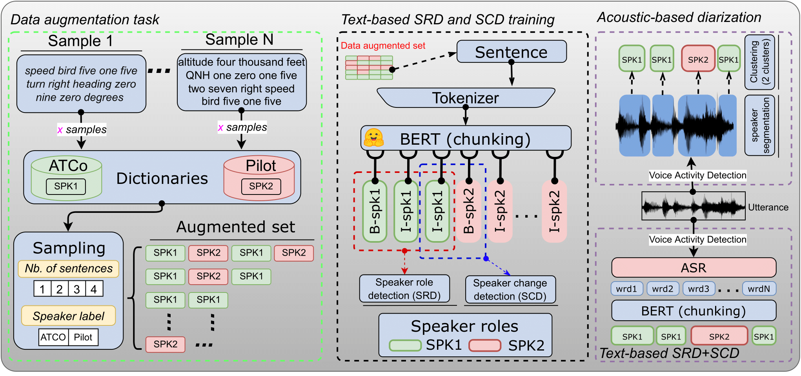

# BERTraffic: BERT-based Joint Speaker Role and Speaker Change Detection for Air Traffic Control Communications 

<p align="center">
    <a href="https://github.com/JuanPZuluaga/bert-text-diarization-atc/blob/master/LICENSE">
        
    </a>
    <a href="https://github.com/idiap/bert-text-diarization-atc">
        
    </a>
</p>

Code for the paper [BERTraffic: BERT-based Joint Speaker Role and Speaker Change Detection for Air Traffic Control Communications](https://arxiv.org/abs/2110.05781). To appear at [IEEE Spoken Language Technology Workshop (SLT 2022)](https://slt2022.org/)


<details>
  <summary markdown="span"><b>Automatic speech recognition (ASR) allows transcribing</b> the communications between air traffic controllers (ATCOs) and aircraft pilots... </summary>

    The transcriptions are used later to extract ATC named entities, e.g.,
    aircraft callsigns. One common challenge is speech activity detection (SAD)
    and speaker diarization (SD). In the failure condition, two or more segments
    remain in the same recording, jeopardizing the overall performance. (SEE
    FIGURE BELOW) We propose a system that combines SAD and a BERT model to
    perform speaker change detection and speaker role detection (SRD) by chunking
    ASR transcripts, i.e., SD with a defined number of speakers together with
    SRD. The proposed model is evaluated on real-life public ATC databases. Our
    BERT SD model baseline reaches up to 10% and 20% token-based Jaccard error
    rate (JER) in public and private ATC databases. We also achieved relative
    improvements of 32% and 7.7% in JERs and SD error rate (DER), respectively,
    compared to VBx, a well-known SD system.

</details>

<p align="center">
 <figure>
  
  <figcaption> Pipeline for BERT-based text diarization.</figcaption>
</figure> 
</p>

Repository written by [Juan Pablo Zuluaga](https://juanpzuluaga.github.io/)

---
## Table of Contents
- [Preparing Environment](#preparing-environment)
- [Usage](#usage)
    - [Download the Data](#download-the-data)
    - [Training one model](#training-one-model)
    - [Train baselines](#train-baselines)
    - [Evaluate models (optional)](#evaluate-models-optional)
- [Evaluate DER outputs of your model](#evaluate-der-outputs-of-your-model)
- [Related work](#related-work)
- [Cite us](#how-to-cite-us)


# Preparing Environment

The first step is to create your environment with the required packages for data preparation, formatting, and to carry out the experiments. You can run the following commands to create the conda environment (assuming CUDA - 11.7):

- Step 1: Using `python 3.10`: install python and the requirements

```bash
git clone https://github.com/idiap/bert-text-diarization-atc
conda create -n diarization python==3.10
conda activate diarization
python -m pip install -r requirements.txt
```

Before running any script, make sure you have `en_US` locale set and `PYTHONPATH` in repository root folder.

```bash
export LANG=en_US.UTF-8 LC_ALL=en_US.UTF-8
export PYTHONPATH=$PYTHONPATH:$(pwd) #assuming you are in root repository folder
```

# Usage

There are several steps to replicate/use our proposed models:

## Download the Data

For our experiments, we used 3 public databases and 2 private databases (see Table 1 on [paper](https://arxiv.org/abs/2110.05781)). We provide scripts to replicate some of the results **ONLY** for the public databases. 

Go to the data folder and follow the step-by-step process (easy) in the [README file](data/README.md).

TL;DR for 1 public & free corpus:


- **Step 1**: download (1.2 GB) for free the **UWB-ATCC CORPUS** from: https://lindat.mff.cuni.cz/repository/xmlui/handle/11858/00-097C-0000-0001-CCA1-0

- **Step 2**: format and prepare the data for experimentation:

```bash
conda activate diarization
bash data/databases/uwb_atcc/data_prepare_uwb_atcc_corpus.sh
bash data/databases/uwb_atcc/exp_prepare_uwb_atcc_corpus.sh
```

-- The output folder should be in `experiments/data/uwb_atcc/{train,test}` -- 

## Training one model

Here, we describe how to train one model with the **UWB-ATCC**, which is **free!!!**

Most of the training and evaluation scripts are in the `src/` folder. The training procedure is very simple. You can train a baseline model with **UWB-ATCC** by calling the high-level script:

```bash
bash src/train_one_model.sh \
  --dataset "uwb_atcc" \
  --train-data experiments/data/uwb_atcc/train/diarization/utt2text_tags \
  --test-data experiments/data/uwb_atcc/test/diarization/utt2text_tags \
  --output-dir "experiments/results/baseline"
```

Additionally, you can modify some training hyperparameters by calling [train_diarization.py](src/train_diarization.py) (which is call internally in `src/train_one_model.sh`) directly and passing values from the CLI, e.g., `--train-batch-size 64` (instead of default=32), or use another encoder, `--input-model "bert-large-uncased"`...

```bash
python3 src/train_diarization.py \
    --report-to none \
    --epochs 4 \
    --seed 1234 \
    --max-train-samples -1 \
    --train-batch-size 32 \
    --eval-batch-size 16 \
    --warmup-steps 500 \
    --logging-steps 1000 \
    --save-steps 10000 \
    --eval-steps 500 \
    --max-steps 3000 \
    --input-model bert-base-uncased \
    --test-data experiments/data/uwb_atcc/test/diarization/utt2text_tags \
    experiments/data/uwb_atcc/train/diarization/utt2text_tags \
    experiments/results/baseline/bert-base-uncased/1234/uwb_atcc
```

## Train baselines

We have prepared some scripts to replicate some baselines from our [paper](https://arxiv.org/abs/2110.05781). 

1) Script to run and evaluate the baseline BERT models for UWB-ATCC and LDC-ATCC (see Table 3 on [paper](https://arxiv.org/abs/2110.05781)):

```bash
bash train_baselines.sh
```

2) Script to run and evaluate the BERT models with DATA augmentation for UWB-ATCC and LDC-ATCC (see Section 3.4 and Table 4 on [paper](https://arxiv.org/abs/2110.05781)). 

You can either train only one model (example for UWB-ATCC and LDC-ATCC corpus):

```bash
bash ablations/train_uwb_atcc_baseline_augmentation.sh
# or, for LDC-ATCC,
bash ablations/train_ldc_atcc_baseline_augmentation.sh
```

or you can train 5 models (per corpus) with different seeds:

```bash
bash ablations/train_uwb_atcc_5seeds_augmentation.sh
# or, for LDC-ATCC,
bash ablations/train_ldc_atcc_5seeds_augmentation.sh
```

## Evaluate models (optional)

We have prepared two scripts to evaluate and perform inference with a defined model, e.g., train and evaluate on UWB-ATCC corpus:

- To evaluate the model and print the metrics in the training folder:
```bash
bash src/eval_model.sh \
  --DATA "experiments/data" \
  --batch-size 16 \
  --dataset "uwb_atcc" \
  --output-dir "experiments/results/baseline"
```

- To get outputs in the `utt2text_tags` format:
```bash
bash src/run_inference.sh \
  --DATA "experiments/data" \
  --batch-size 16 \
  --dataset "uwb_atcc" \
  --output-dir "experiments/results/baseline"
```

If you want to do something more specific, like, use **UWB-ATCC corpus** for training and evaluate on **ATCO2-test-set corpus**, you can use the python script directly as:

```bash
# this is the folder where the model is located
EXP_FOLDER=experiments/results/baseline/bert-base-uncased/1234/uwb_atcc/

python3 src/eval_diarization.py \
    --input-model "$EXP_FOLDER/final_checkpoint" \
    --batch-size 32 \
    --input-files "experiments/data/atco2_corpus/test/diarization/utt2text_tags" \
    --test-names "atco2_corpus" \
    --output-folder "$EXP_FOLDER/evaluations"
```

That will generate inference outputs on the `$EXP_FOLDER/evaluations`, OR in `$EXP_FOLDER/inference` if you use [inference_diarization.py](src/inference_diarization.py) instead of [eval_diarization.py](src/eval_diarization.py)

---
## Evaluate DER outputs of your model 

Here, we describe briefly how to evaluate the outputs of your model with standard acoustic-based metrics, e.g., DER and JER.

This is of special usage when evaluating the model on ASR transcripts. Here, you need to first perform [force alignment](https://linguistics.berkeley.edu/plab/guestwiki/index.php?title=Forced_alignment) to align text tokens to acoustic timing. 

1) You need to get the force alignment beween speech/transcription pairs using some force alignment toolkits e.g. [Kaldi-aligner](https://github.com/amirharati/kaldi-alligner) to get a `CTM file`. 

Which looks like this: 
```bash
uwb_atcc_augmented_00000_C 1 0.09 0.05 wizz 1.00 
uwb_atcc_augmented_00000_C 1 0.14 0.04 air 1.00 
uwb_atcc_augmented_00000_C 1 0.19 0.07 four 1.00 
uwb_atcc_augmented_00000_C 1 0.26 0.05 nine 1.00 
uwb_atcc_augmented_00000_C 1 0.31 0.05 one 1.00 
uwb_atcc_augmented_00000_C 1 0.36 0.09 contact 1.00 
uwb_atcc_augmented_00000_C 1 0.45 0.07 praha 1.00 
uwb_atcc_augmented_00000_C 1 0.52 0.12 radar 1.00 
uwb_atcc_augmented_00000_C 1 0.64 0.06 one 1.00 
uwb_atcc_augmented_00000_C 1 0.70 0.05 two 1.00 
uwb_atcc_augmented_00000_C 1 0.75 0.08 zero 1.00 
uwb_atcc_augmented_00000_C 1 0.83 0.12 decimal 1.00 
uwb_atcc_augmented_00000_C 1 0.95 0.04 two 1.00 
uwb_atcc_augmented_00000_C 1 1.00 0.07 seven 1.00 
uwb_atcc_augmented_00000_C 1 1.08 0.09 five 1.00 
uwb_atcc_augmented_00000_C 1 1.17 0.03 good 1.00 
uwb_atcc_augmented_00000_C 1 1.20 0.09 bye 0.95 
```

2) To evaluate the DER for subset a of `uwb_atcc` corpus, you can check the required files in `experiments/data/uwb_atcc_subset`. For computing the DER on this subset, you can run:

```bash
bash src/eval_der.sh
```

We share this folder which contains only some examples for computing the acoustic-based DER. 

## Get the metrics

We prepared one script ([get_metrics.py](src/get_metrics.sh) that list all the performances produced in the `$EXP_FOLDER/evaluations` for a given model. For instance, if you run: 

- MODEL with UWB-ATCC corpus is trained in: `experiments/results/baseline/bert-base-uncased/1234/uwb_atcc`

```bash
bash src/get_metrics.sh --evaluation-folder experiments/results/baseline/bert-base-uncased/1234/uwb_atcc/evaluations
```

# Related work

Here is a list of papers that are somehow related to AI/ML targeted to Air traffic control communications:

- Fine-tuning a pretrained [Wav2vec 2.0](https://github.com/facebookresearch/fairseq/tree/main/examples/wav2vec) model for automatic speech recognition: 
    - paper: [How Does Pre-trained Wav2Vec 2.0 Perform on Domain Shifted ASR? An Extensive Benchmark on Air Traffic Control Communications](https://arxiv.org/abs/2203.16822)
    - code: https://github.com/JuanPZuluaga/w2v2-air-traffic

- How to use contextual data (biasing) in ATC automatic speech recognition:
    - Paper: [A two-step approach to leverage contextual data: speech recognition in air-traffic communications](https://arxiv.org/abs/2202.03725)
- ATCO2 corpus derived from the [ATCO2 project](https://www.atco2.org/): this is a extensive work describing how we collected more than 5000 hours of ATC communications. Later, we pre-transcribed it and trained ASR and NLP models for ATC communications:
    - paper: [ATCO2 corpus: A Large-Scale Dataset for Research on Automatic Speech Recognition and Natural Language Understanding of Air Traffic Control Communications](https://arxiv.org/abs/2211.04054)
    - code: https://github.com/idiap/atco2-corpus
- Ethics in collection ATC data: [Legal and Ethical Challenges in Recording Air Traffic Control Speech](https://aclanthology.org/2022.legal-1.14/)


Some other papers:

- [Boosting of contextual information in ASR for air-traffic call-sign recognition](http://www.fit.vutbr.cz/research/groups/speech/publi/2021/kocour21_interspeech.pdf)
- [Grammar Based Identification Of Speaker Role For Improving ATCO And Pilot ASR](https://arxiv.org/abs/2108.12175)
- [Contextual Semi-Supervised Learning: An Approach To Leverage Air-Surveillance and Untranscribed ATC Data in ASR Systems](https://arxiv.org/abs/2104.03643)
- [Automatic Processing Pipeline for Collecting and Annotating Air-Traffic Voice Communication Data](https://www.mdpi.com/2673-4591/13/1/8)
- [Automatic Call Sign Detection: Matching Air Surveillance Data with Air Traffic Spoken Communications](https://www.mdpi.com/2504-3900/59/1/14)
- [Improving callsign recognition with air-surveillance data in air-traffic communication](https://arxiv.org/abs/2108.12156)
- [Automatic Speech Recognition Benchmark for Air-Traffic Communications](https://arxiv.org/abs/2006.10304)


# How to cite us

If you use this code for your research, please cite our paper with:

Zuluaga-Gomez, J., Sarfjoo, S. S., Prasad, A., Nigmatulina, I., Motlicek, P., Ondrej, K., Ohneiser, O., & Helmke, H. (2021). BERTraffic: BERT-based Joint Speaker Role and Speaker Change Detection for Air Traffic Control Communications. 2022 IEEE Spoken Language Technology Workshop (SLT), Doha, Qatar.

or use the bibtex item:

```
@article{zuluaga2022bertraffic,
  title={BERTraffic: BERT-based Joint Speaker Role and Speaker Change Detection for Air Traffic Control Communications},
  author={Zuluaga-Gomez, Juan and Sarfjoo, Seyyed Saeed and Prasad, Amrutha and Nigmatulina, Iuliia and Motlicek, Petr and Ondre, Karel and Ohneiser, Oliver and Helmke, Hartmut},
  journal={IEEE Spoken Language Technology Workshop (SLT), Doha, Qatar},
  year={2022}
  }
```
